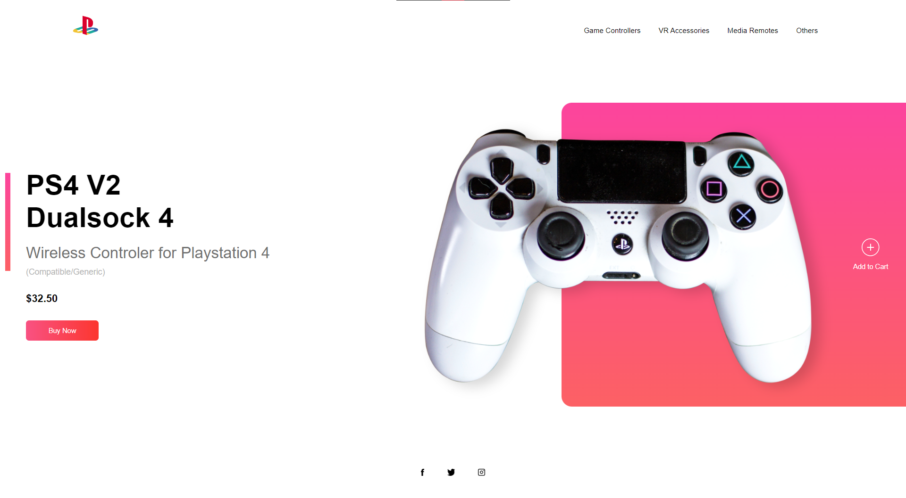

# Gaming Store

A loja de videogames é um website responsivo desenvolvido com HTML e CSS, oferecendo uma experiência de compra de acessórios de videogame. Com seu design adaptável, o site se ajusta perfeitamente a diversos dispositivos, permitindo aos usuários explorar e adquirir acessórios de videogames, incluindo controles, headsets e outros itens.

## 🚀 Demonstração

[Clique aqui](https://flaviomattosdev.github.io/Gaming-Store/) para acessar o resultado final do projeto.

## 🛠️ Tecnologias Utilizadas

* [HTML](https://developer.mozilla.org/pt-BR/docs/Web/HTML) - Linguagem de Marcação
* [CSS](https://developer.mozilla.org/pt-BR/docs/Web/CSS) - Linguagem de Estilização

## 👨‍💻 Desenvolvedor

    
    
&nbsp&nbsp&nbspFlávio Mattos 
    &nbsp&nbsp&nbsp<a href="https://www.instagram.com/fflaviomattos/">Instagram</a>&nbsp;|&nbsp;<a href="https://github.com/FlavioMattosDev">GitHub</a>&nbsp;|&nbsp;<a href="https://www.linkedin.com/in/flavio-mattos/">LinkedIn</a>&nbsp;

  

---
